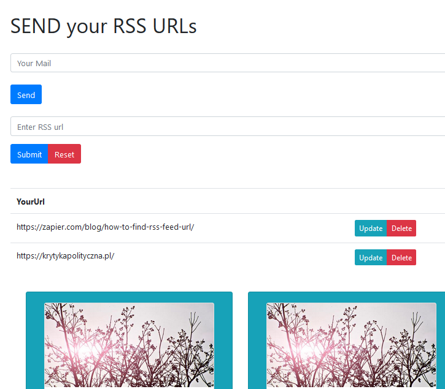
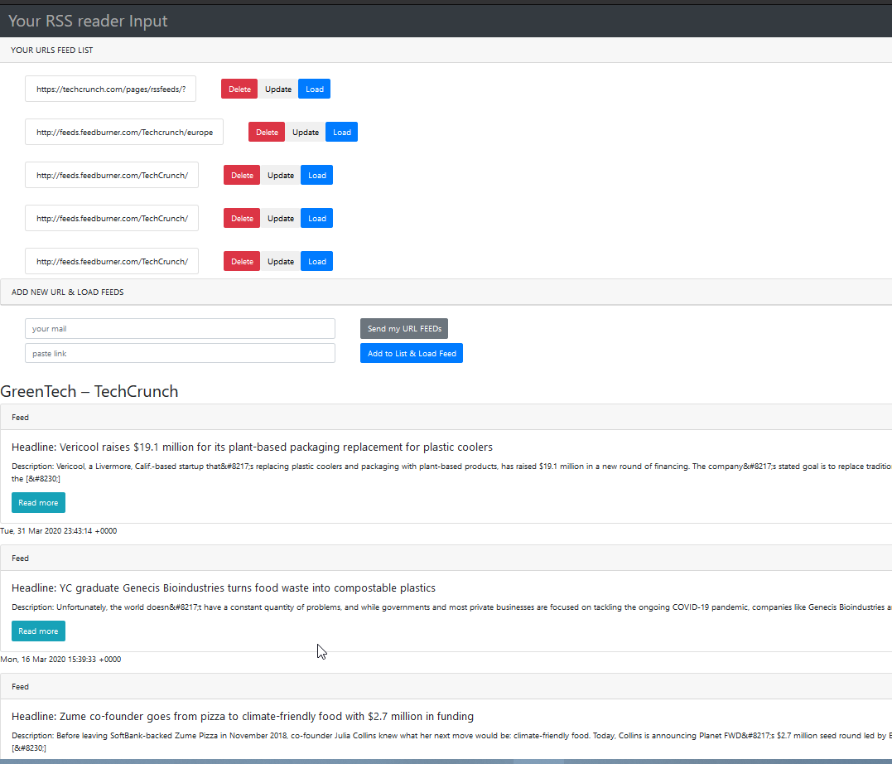
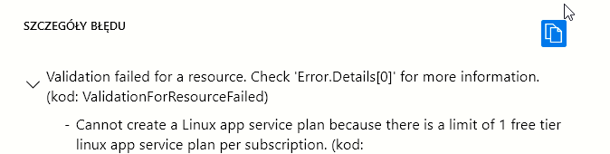
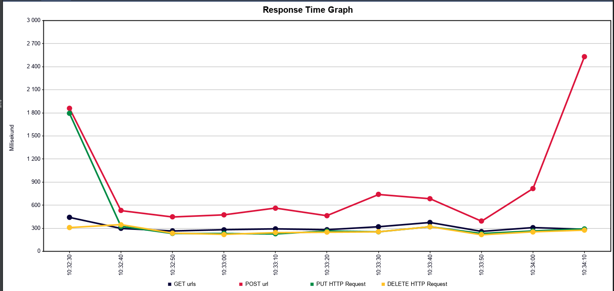

# flask_vue_rest_CRUD application

APLIKACJA została postawiona na usłudze Azure App Service - osobno 
Backend pod adresem https://sendurlsback.azurewebsites.net/ [środowisko uruchomieniowe z Pythonem 3.7]
i osobno frontend - pod adresem https://flaskvue.azurewebsites.net [ środowisko uruchomieniowe node.js backend odpowiada na żadania przy pomocy biblioteki axios]

[RSS poprawnie odbierający feed jest w innej aplikacji pod adresem kod https://github.com/ulou23/rssdjango]
 
nie wdrożyłam bo w planie dla studentów jest limit 

dlatego zdecydowałam się robić testy na pierwszej aplikacji, w ktorej prawidłowo działa API REST meody tylko zle szczytuje grafikę z rssow 
###https://flaskvue.azurewebsites.net
INTERFACE KOD FRONTEND https://github.com/ulou23/flask_vue_rest_FRONT/

### TESTY JMETER wykonane HTTP METODY requests API request methods > w pliku BACKEND 
## application.py
KOD BACKEND https://github.com/ulou23/flask_vue_rest_BACKEND python Flask

##TEST DOTYCZY API >>> 

###https://sendurlsback.azurewebsites.net/urls [DELETE i POST]

###https://sendurlsback.azurewebsites.net/urls/<id_url> [PUT I DELETE]

# ANALIZA RAPORTU JMETER
 test wydajnościowy
 grupa 100 usersa na 100 sekund
 
 throughput  Aggregate raport
------------- 
 GET     1.0/sec 
 
 POST    1.0/sec
 
 PUT    | 1.0/sec
 
 DELETE | 1.0/sec
 
 

najdłuzszy czas odpowiedzi ma żadanie POST Max 1004 ms
average response time 304 ms

 Test Plan. 

    Add → Thread Group – element odpowiedzialny za ilość użytkowników jacy będą wywoływać zapytania HTTP na serwerze.
    Add → Sampler → HTTP Request – element odpowiedzialny za kliknięcie. Komponent generuje zapytanie GET / POST po protokole HTTP.

####the throughput
WYDAJNOŚĆ  liczba żądań przetwarzanych na sekundę. 

Graph Aggregate  daje wynik 241 request/ minute  nie jest to za dobry wynik
####deviation 
Odchylenie standardowe określa ilościowo, jak długo czas odpowiedzi waha się wokół jego średniej.
 Nie zaleca się oceniania wydajności systemu na podstawie odchylenia standardowego. 
Odchylenia powinny być minimalne, tj. Mniejsze niż 5%

####latency 
Opóźnienie: liczba milisekund, które upłynęły między wysłaniem żądania przez JMeter a otrzymaniem wstępnej odpowiedzi
####sample time 
liczba milisekund wymaganych przez serwer do pełnego obsłużenia żądania (response + latency)
<listener > view in table  
POST metoda ma najdłuższy sample time a DELETE NAJKROTSZY 

###how many users your application can handle 
without scaling

MAXIMUM LOAD SERVER =  RESPONSE TIME I RESPONSE ERROR
oszacować max liczbe użytkowników, którzy jednocześnie użytkują aplikację - ilośc ruchu który może
obsłużyć serwer
- wydajność bazy danych 
- liczba rdzeni procesora serwera na którym mamy postawioną aplikację
- jaki czas CPU wykorzystuje do wygenerowania strony [ np. time to the first byte + the Content Dowload Time]

wg google analythics formuła
Number CPU cores / **Average time for a page request(in sec)** = max number of page request per sec
Number of max request per sec * 60* click frequency (np. _moja aplikacja >> input w formularzu url'a_) of users in sec = Max  Number of simultaneius Users

im dłuższy sredni czas odpowiedzi na request przy innych składnikach formuły stałych tym mniej użytkowników strona obsłuży
 
####response times &failing request
